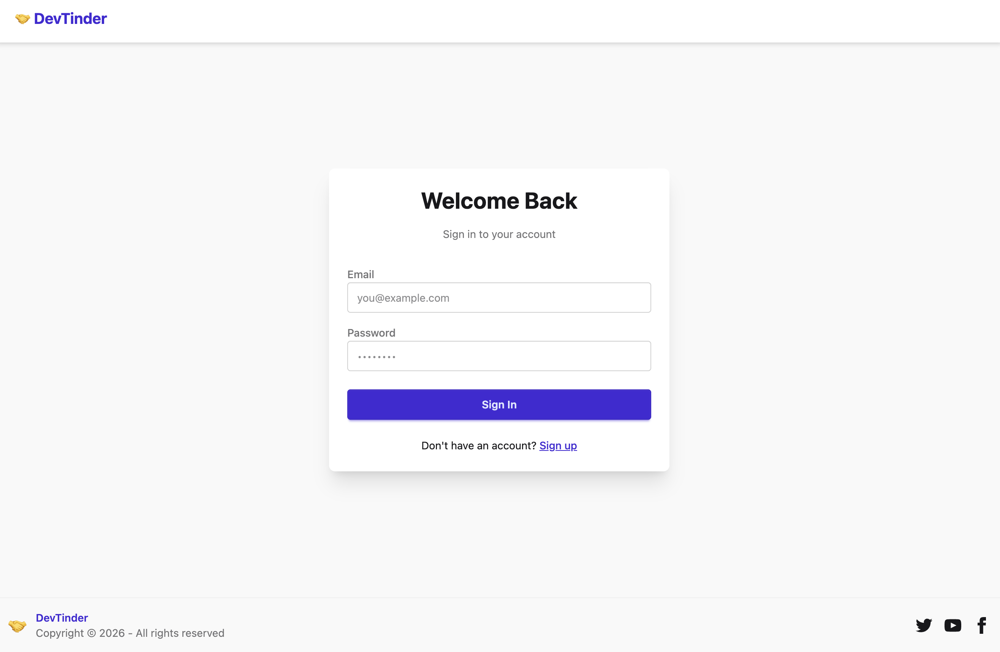
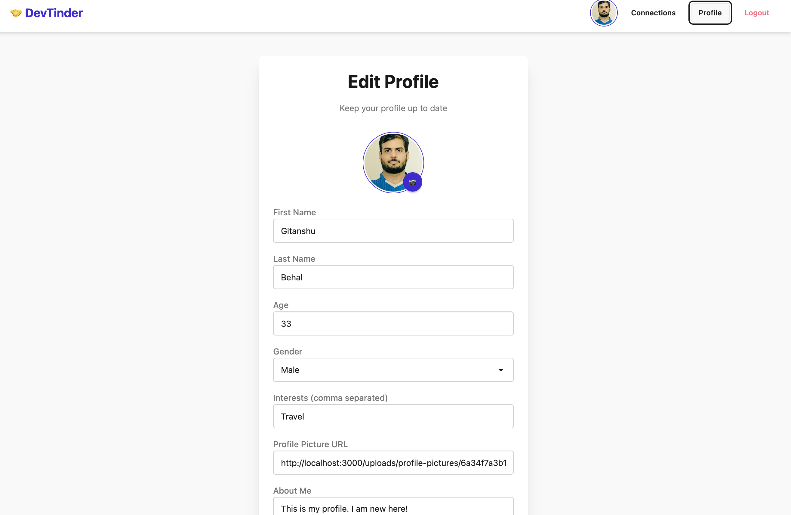

# DevTinder

DevTinder is a Tinder-inspired matchmaking app, built while practising [Akshay Saini's Namaste Node.js](https://namastedev.com/) course. The course goes deep into how Node.js, Express, MongoDB and React actually work under the hood, and this project is the hands-on result — a full MERN stack application with auth, profiles, connection requests, and a swipeable feed.

## Tech Stack

### Backend

- **Node.js** + **Express 5** — REST API server
- **MongoDB** + **Mongoose** — database and schema modelling
- **JWT (jsonwebtoken)** — stateless authentication via HTTP-only cookies
- **bcrypt** — password hashing
- **cookie-parser** — reading auth cookies off incoming requests
- **cors** — restricting cross-origin access to the frontend
- **multer** — handling profile picture uploads
- **validator** — input validation (emails, URLs, etc.)
- **dotenv** — environment variable management
- **Jest**, **Supertest**, **mongodb-memory-server** — API/unit testing against an in-memory Mongo instance
- **nodemon** — auto-restart during development

### Frontend

- **React 19** + **Vite** — UI and dev/build tooling
- **Redux Toolkit** + **React Redux** — global state management (auth, feed, connections)
- **React Router** — client-side routing
- **Tailwind CSS 4** + **daisyUI** — utility-first styling and component classes
- **Axios** — HTTP client for talking to the backend API
- **react-error-boundary** — graceful error handling in the UI
- **Vitest** + **React Testing Library** — component testing
- **ESLint** + **Prettier** — linting and formatting

## Features

- **Sign up / Login / Logout** — JWT-based auth stored in HTTP-only cookies, passwords hashed with bcrypt
- **Profile management** — view and edit profile (name, age, gender, interests, about me), upload a profile picture, change password
- **Feed** — paginated and cursor-based feeds of users you haven't interacted with yet
- **Connection requests** — send "interested"/"ignored" requests to other users, accept/reject incoming requests
- **Matches** — view all your accepted connections (mutual matches)
- **Health check endpoint** — for uptime/monitoring checks

## Screenshots

| Login                                | Edit Profile                                       |
| ------------------------------------ | -------------------------------------------------- |
|  |  |

## Project Structure

```
DevTinder-NamasteNodeJS/
├── Backend/        # Express API server
│   ├── src/
│   │   ├── config/         # DB connection
│   │   ├── middlewares/    # Auth middleware
│   │   ├── model/          # Mongoose schemas (User, ConnectionRequest)
│   │   ├── routes/         # auth, profile, request, user, health routes
│   │   ├── utils/          # Validation helpers
│   │   └── __tests__/      # Jest + Supertest API tests
│   └── uploads/            # Uploaded profile pictures
└── Frontend/       # React + Vite client
    └── src/
```

## Getting Started

### Prerequisites

- Node.js (v18+ recommended)
- A MongoDB instance (local or [MongoDB Atlas](https://www.mongodb.com/atlas))

### 1. Clone the repo

```bash
git clone <your-repo-url>
cd DevTinder-NamasteNodeJS
```

### 2. Backend setup

```bash
cd Backend
npm install
cp .env.example .env
```

Edit `Backend/.env` and fill in your own values:

```
MONGO_URI=mongodb+srv://<username>:<password>@<cluster-url>/<database-name>
JWT_SECRET=replace-with-a-long-random-string
PORT=3000
CORS_ORIGIN=http://localhost:5173
NODE_ENV=development
```

Run the backend:

```bash
npm run dev     # starts with nodemon (auto-restart)
# or
npm start       # plain node start
```

The API will be available at `http://localhost:3000`.

Run backend tests:

```bash
npm test
```

### 3. Frontend setup

Open a new terminal:

```bash
cd Frontend
npm install
cp .env.example .env
```

Edit `Frontend/.env`:

```
VITE_BASE_URL=http://localhost:3000
```

Run the frontend dev server:

```bash
npm run dev
```

The app will be available at `http://localhost:5173` (Vite's default port).

### 4. Whitelisting the frontend on the backend

The backend only accepts requests from the origin set in `CORS_ORIGIN` (see `Backend/.env`). Make sure this matches the URL your frontend is actually running on (e.g. `http://localhost:5173`), otherwise API calls from the browser will be blocked by CORS.

### 5. Build for production (frontend)

```bash
cd Frontend
npm run build      # outputs to Frontend/dist
npm run preview    # preview the production build locally
```

## Notes

- Never commit your `.env` files — only `.env.example` files (with placeholder values) are tracked in this repo.
- If you fork this project for your own use, generate your own `JWT_SECRET` and MongoDB credentials rather than reusing any sample values.
